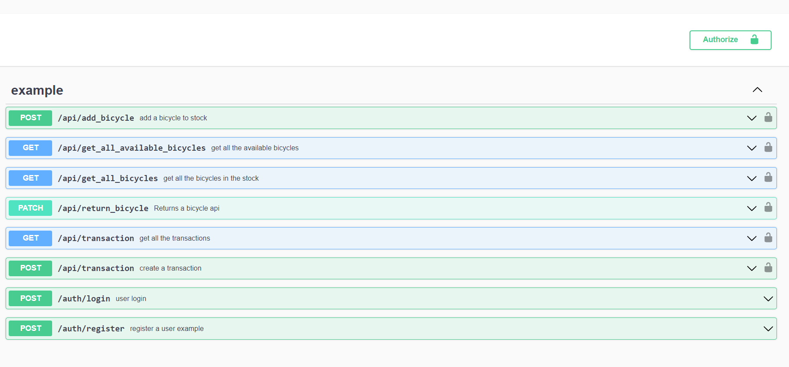
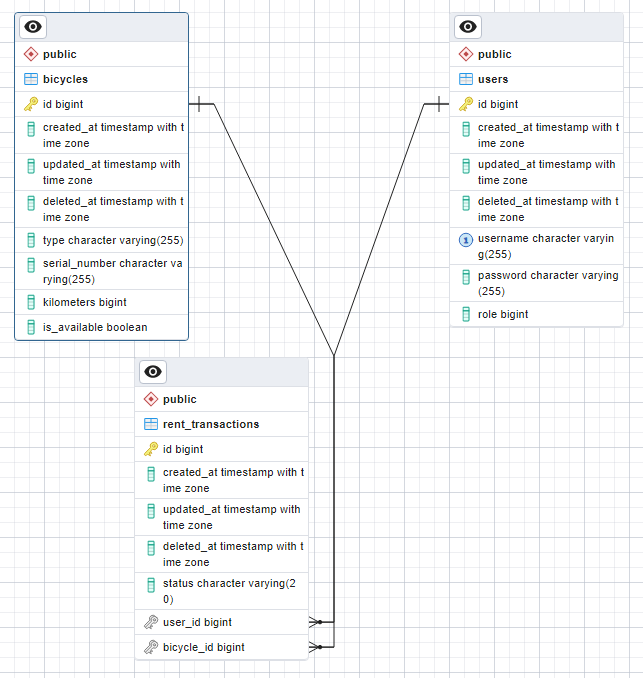

# Bicycle sharing service

A rest API for a bicycle sharing service.

## Prerequisites 

- Go
- PSQL
- PostgreSQL

## Installation

Install dependencies

    go get \
    github.com/gin-gonic/gin \
    github.com/golang-jwt/jwt/v4 \
    github.com/joho/godotenv \
    golang.org/x/crypto \
    gorm.io/driver/postgres \
    gorm.io/gorm \
    github.com/swaggo/swag/cmd/swag

    go install github.com/swaggo/swag/cmd/swag@latest

    go get \
    -u github.com/swaggo/gin-swagger \
    -u github.com/swaggo/files

Prepare database and the environment variables

    createdb -h <DB_HOSTNAME> -p <DB_PORT> -U <DB_USER> bike_sharing_app --password

Copy and adjust the .env file 

    cp .env .env.local

## Start the application

    go run main.go

## Endpoints

For swagger:

    http://localhost:8000/swagger/index.html

Swagger docs:

    docs\swagger.yaml

## Models

